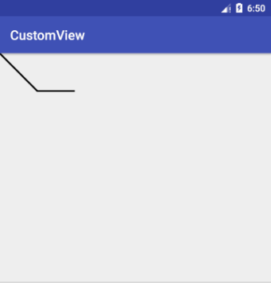
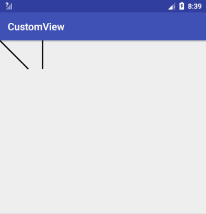
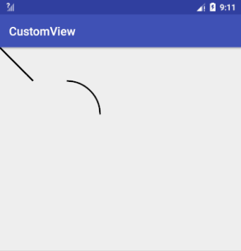
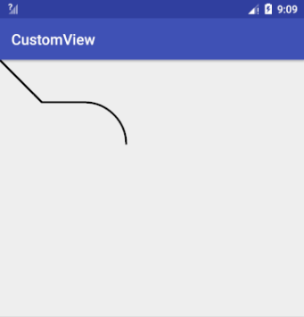
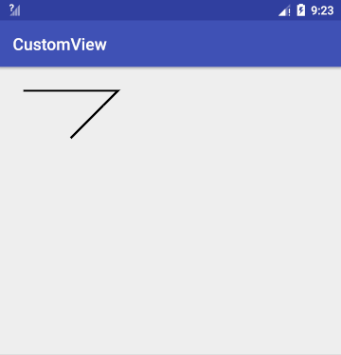
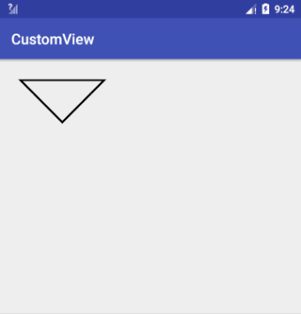

## drawPath 绘制自定义图形

上一篇说过，drawPath(path) 这个方法是通过描述路径的方式来绘制图形的，它的 path 参数就是用来描述图形路径的对象。

Path 可以描述直线、二次曲线、三次曲线、圆、椭圆、弧形、矩形、圆角矩形。把这些图形结合起来，就可以描述出很多复杂的图形。下面我就说一下具体的怎么把这些图形描述出来。

Path 有两类方法，一类是直接描述路径的，另一类是辅助的设置或计算。

<!-- more -->

## Path 方法第一类：直接描述路径。

这一类方法还可以细分为两组：添加子图形和画线（直线或曲线）

### 第一组： addXxx() ——添加子图形

### 添加圆<br>addCircle(float x, float y, float radius, Direction dir) 

x, y, radius 这三个参数是圆的基本信息，最后一个参数 dir 是画圆的路径的方向。

路径方向有两种：顺时针（CW clockwise）和逆时针（CWW counter-clockwise）。对于普通情况，这个参数是CW或者CWW，没有什么影响。它只是在需要填充图形，并且图形出现自相交时，用于判断填充范围的。

> 具体怎么做，下面 Path.setFillType() 的时候会详细介绍，而在这里可以先忽略 dir 这个参数。

```
path.addCircle(250, 250, 200, Path.Direction.CW);
canvas.drawPath(path, paint);
```


可以看出，path.AddCircle(x, y, radius, dir) + canvas.drawPath(path, paint) 这种写法，和直接使用  canvas.drawCircle(x, y, radius, paint) 的效果是一样的，区别只是它的写法更复杂。所以如果只画一个圆，没必要用 Path，直接用 drawCircle() 就行了。drawPath() 一般是在绘制组合图形时才会用到的。

其他的 Path.add-() 方法和这类似，例如：

### 添加椭圆<br>addOval(float left, float top, float right, float bottom, Direction dir) <br>addOval(RectF oval, Direction dir) 

### 添加矩形<br>addRect(float left, float top, float right, float bottom, Direction dir) <br>addRect(RectF rect, Direction dir)

### 添加圆角矩形<br>addRoundRect(RectF rect, float rx, float ry, Direction dir)<br>addRoundRect(float left, float top, float right, float bottom, float rx, float ry, Direction dir) <br>addRoundRect(RectF rect, float[] radii, Direction dir)<br>addRoundRect(float left, float top, float right, float bottom, float[] radii, Direction dir) 

### 添加弧形<br>addArc(float left, float top, float right, float bottom, float startAngle, float sweepAngle)<br>addArc(RectF oval, float startAngle, float sweepAngle)

### 添加另一个 Path<br>addPath(Path path) 

上面这几个方法和 addCircle() 的使用都差不多，不再做过多介绍。

### 第二组： xxxTo() ——画线（直线或曲线）

这一组和第一组 addXxx() 方法的区别在于，第一组是添加的完整封闭图形（除了 addPath() ），而这一组添加的只是一条线。

### 画直线<br>lineTo(float x, float y) <br>rLineTo(float x, float y) 

从当前位置向目标位置画一条直线， x 和 y 是目标位置的坐标。这两个方法的区别是，lineTo(x, y) 的参数是绝对坐标，而 rLineTo(x, y) 的参数是相对当前位置的相对坐标 （前缀 r 指的就是 relatively 「相对地」)。

> 当前位置：所谓当前位置，即最后一次调用画 Path 的方法的终点位置。初始值为原点 (0, 0)。

```
paint.setStyle(Style.STROKE);  
path.lineTo(100, 100); // 由当前位置 (0, 0) 向 (100, 100) 画一条直线  
path.rLineTo(100, 0); // 由当前位置 (100, 100) 向正右方 100 像素的位置画一条直线  
```



### 画二次贝塞尔曲线<br>quadTo(float x1, float y1, float x2, float y2)<br>rQuadTo(float dx1, float dy1, float dx2, float dy2)

这条二次贝塞尔曲线的起点就是当前位置，而参数中的 x1, y1 和 x2, y2 则分别是控制点和终点的坐标。和 rLineTo(x, y) 同理，rQuadTo(dx1, dy1, dx2, dy2) 的参数也是相对坐标。

### 画三次贝塞尔曲线<br>cubicTo(float x1, float y1, float x2, float y2, float x3, float y3)<br>rCubicTo(float x1, float y1, float x2, float y2, float x3, float y3)

cubicTo() 和 rCubicTo() 是三次贝塞尔曲线

> 贝塞尔曲线：贝塞尔曲线是几何上的一种曲线。它通过起点、控制点和终点来描述一条曲线，主要用于计算机图形学。概念总是说着容易听着难，总之使用它可以绘制很多圆润又好看的图形，但要把它熟练掌握、灵活使用却是不容易的。不过还好的是，一般情况下，贝塞尔曲线并没有什么用处，只在少数场景下绘制一些特殊图形的时候才会用到，所以如果你还没掌握自定义绘制，可以先把贝塞尔曲线放一放，稍后再学也完全没问题。

### 移动到目标位置<br>moveTo(float x, float y)<br>rMoveTo(float x, float y)

不论是直线还是贝塞尔曲线，都是以当前位置作为起点，而不能指定起点。通过 moveTo(x, y) 或  rMoveTo() 来改变当前位置，从而间接地设置这些方法的起点。

```
path.lineTo(200, 200);
path.moveTo(300, 200);
path.lineTo(300, 0);
```



moveTo(x, y) 虽然不添加图形，但它会设置图形的起点，所以它是非常重要的一个辅助方

###  画弧形<br>arcTo(RectF oval, float startAngle, float sweepAngle, boolean forceMoveTo)<br>arcTo(float left, float top, float right, float bottom, float startAngle, float sweepAngle, boolean forceMoveTo)<br>arcTo(RectF oval, float startAngle, float sweepAngle)

这个方法和 Canvas.drawArc() 比起来，少了一个参数 useCenter，而多了一个参数 forceMoveTo 。

少了 useCenter ，是因为 arcTo() 只用来画弧形而不画扇形，所以不再需要 useCenter 参数；而多出来的这个 forceMoveTo 参数的意思是，绘制是要「抬一下笔移动过去」，还是「直接拖着笔过去」，区别在于是否留下移动的痕迹。

> 注意：不使用当前位置作为弧线的起点。

```
//forceMoveTo 为true，抬一下笔移动过去
path.lineTo(200, 200);
path.arcTo(200, 200, 600, 600, -90, 90, true);
```



```
//forceMoveTo 为true，直接拖着笔过去
path.lineTo(200, 200);
path.arcTo(200, 200, 600, 600, -90, 90, false);
```



在第一组中有一个addArc()方法，也都是绘制弧形，只是addArc()默认直接使用了 forceMoveTo = true 的简化版 arcTo() 。

### 封闭当前子图形<br>close()

它的作用是把当前的子图形封闭，即由当前位置向当前子图形的起点绘制一条直线。

```
path.moveTo(100, 100);
path.lineTo(500, 100);
path.lineTo(300, 300);
```



```
path.moveTo(100, 100);
path.lineTo(500, 100);
path.lineTo(300, 300);
path.close(); // 使用 close() 封闭子图形。等价于 path.lineTo(100, 100)  
```



不是所有的子图形都需要使用 close() 来封闭。当需要填充图形时（即 Paint.Style 为 FILL 或  FILL_AND_STROKE），Path 会自动封闭子图形。

## Path 方法第二类：辅助的设置或计算

这类方法的使用场景比较少，主要讲其中一个方法：  
`setFillType(FillType fillType)`。

### Path.setFillType(Path.FillType ft) 设置填充方式

前面在说 dir 参数的时候提到， Path.setFillType(fillType) 是用来设置图形自相交时的填充算法的：


方法中填入不同的 `FillType` 值，就会有不同的填充效果。`FillType` 的取值有四个：

- `EVEN_ODD`
- `WINDING` （默认值）
- `INVERSE_EVEN_ODD`
- `INVERSE_WINDING`

其中后面的两个带有 `INVERSE_` 前缀的，只是前两个的反色版本，所以只要把前两个，即 `EVEN_ODD` 和 `WINDING`，搞明白就可以了。

`EVEN_ODD` 和 `WINDING` 的原理有点复杂，直接讲出来的话信息量太大，所以我先给一个简单粗暴版的总结，你感受一下： `WINDING` 是「全填充」，而 `EVEN_ODD` 是「交叉填充」：


之所以叫「简单粗暴版」，是因为这些只是通常情形下的效果；而如果要准确了解它们在所有情况下的效果，就得先知道它们的原理，即它们的具体算法。

### EVEN_ODD 和 WINDING 的原理

#### EVEN_ODD

即 even-odd rule （奇偶原则）：对于平面中的任意一点，向任意方向射出一条射线，这条射线和图形相交的次数（相交才算，相切不算哦）如果是奇数，则这个点被认为在图形内部，是要被涂色的区域；如果是偶数，则这个点被认为在图形外部，是不被涂色的区域。还以左右相交的双圆为例：


> 射线的方向无所谓，同一个点射向任何方向的射线，结果都是一样的，不信你可以试试。

从上图可以看出，射线每穿过图形中的一条线，内外状态就发生一次切换，这就是为什么 `EVEN_ODD` 是一个「交叉填充」的模式。

#### WINDING

即 non-zero winding rule （非零环绕数原则）：首先，它需要你图形中的所有线条都是有绘制方向的：


然后，同样是从平面中的点向任意方向射出一条射线，但计算规则不一样：以 0 为初始值，对于射线和图形的所有交点，遇到每个顺时针的交点（图形从射线的左边向右穿过）把结果加 1，遇到每个逆时针的交点（图形从射线的右边向左穿过）把结果减 1，最终把所有的交点都算上，得到的结果如果不是 0，则认为这个点在图形内部，是要被涂色的区域；如果是 0，则认为这个点在图形外部，是不被涂色的区域。


> 和 `EVEN_ODD` 相同，射线的方向并不影响结果。

所以，我前面的那个「简单粗暴」的总结，对于 `WINDING` 来说并不完全正确：如果你所有的图形都用相同的方向来绘制，那么 `WINDING` 确实是一个「全填充」的规则；但如果使用不同的方向来绘制图形，结果就不一样了。

> 图形的方向：对于添加子图形类方法（如 `Path.addCircle()` `Path.addRect()`）的方向，由方法的 `dir` 参数来控制，这个在前面已经讲过了；而对于画线类的方法（如 `Path.lineTo()` `Path.arcTo()`）就更简单了，线的方向就是图形的方向。

所以，完整版的 `EVEN_ODD` 和 `WINDING` 的效果应该是这样的：


而 `INVERSE_EVEN_ODD` 和 `INVERSE_WINDING` ，只是把这两种效果进行反转而已，懂了 `EVEN_ODD` 和 `WINDING`，自然也就懂 `INVERSE_EVEN_ODD` 和 `INVERSE_WINDING` 了。

关于drawPath()差不多这么多，图形简单时，使用 drawCircle() drawRect() 等方法来直接绘制；图形复杂时，使用 drawPath() 来绘制自定义图形。